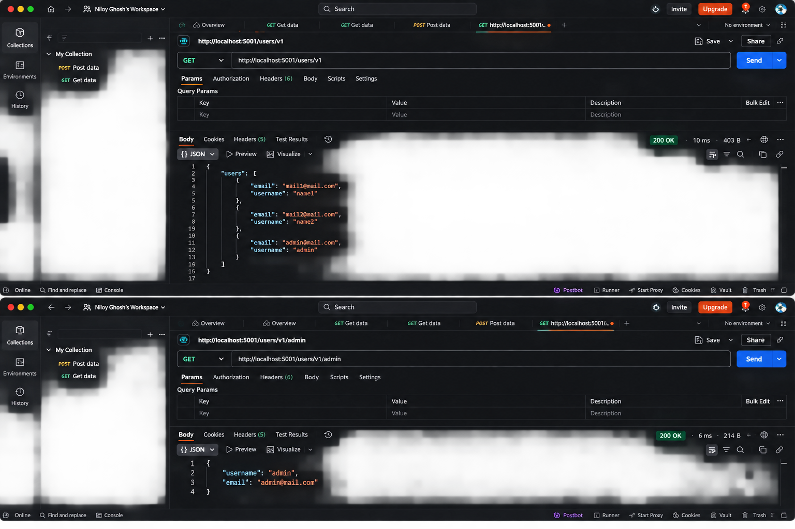

# VAmPI API Security Assessment

## Executive Summary

A black-box security assessment was performed against the intentionally vulnerable VAmPI REST API application. The assessment identified a **Critical Broken Object Level Authorization (BOLA)** vulnerability that allows unauthenticated access to individual user records and the complete user collection.

## Finding: Broken Object Level Authorization (BOLA)

**Severity:** Critical  
**CVSS v3.1:** 9.1  
**OWASP API Top 10:** API1:2023 – Broken Object Level Authorization

### Affected Endpoints

- `GET /users/v1/{username}`
- `GET /users/v1`

### Description

The affected endpoints fail to enforce authorization checks before returning user resources. An unauthenticated attacker can request a known username and retrieve its user object. The collection endpoint can also expose the complete set of users.

### Proof of Concept

#### Single-user lookup

```http
GET /users/v1/admin HTTP/1.1
Host: <target>
```

The server returns the requested user object without requiring valid authentication or authorization.

#### Full user dump

```http
GET /users/v1 HTTP/1.1
Host: <target>
```

The endpoint returns multiple user records without authorization, enabling bulk data exposure.

### Evidence



The evidence image contains both proof-of-concept requests: the unauthenticated `GET /users/v1` full user dump and the unauthenticated `GET /users/v1/admin` single-user lookup.

### Impact

An attacker can enumerate users and access information that should be restricted to authorized clients. The collection endpoint significantly increases the exposure by enabling bulk extraction of user records.

### Remediation

Implement server-side authorization checks for every object access. Do not rely on the client to provide or enforce authorization. Validate that the authenticated principal is permitted to access the requested user resource, apply appropriate role-based or attribute-based access control, and protect collection endpoints against unauthorized bulk enumeration. Add automated authorization tests for both individual-object and collection access.

## Conclusion

The observed BOLA issue is a critical API authorization weakness and should be remediated before the application is exposed to untrusted users or production traffic.
